#  Coloring With Limited Data: Few-Shot Colorization via Memory Augmented Networks

## Overview

An unofficial implementation of MemoPainter described in the paper using PyTorch.
* [ Coloring With Limited Data:  Few-shot Colorization via Memory Augmented Networks](https://arxiv.org/abs/1906.11888)

Published in CVPR 2019, written by S. Yoo, H. Bahng, S. Chung, J. Lee, J. Chang and J. Choo

## Requirement
- Python 3.6.5
- PyTorch 1.1.0 
- Pillow 5.1.0
- numpy 1.14.5
- scikit-image 0.15.0
- scikit-learn 0.19.0
- colorthief 0.2.1

## Datasets
- [Oxford102](http://www.robots.ox.ac.uk/~vgg/data/flowers/102/)
- [Pokemon](https://www.kaggle.com/kvpratama/pokemon-images-dataset) (For one-shot colorization)
- [Superhero](https://drive.google.com/open?id=1GhxcPJAatGUPB6acw1-wVXgjBTC9B1Aa) (For few-shot colorization) I crawled images from the internet.

## Pre-trained model
- [FlowerColorizationModel](https://drive.google.com/open?id=1QoOEUDq6jNweSb8YaIttEwm1zFq7Fgf3)
(Color_feature : RGB colors extracted by ColorThief)

- [PokemonColorizationModel](https://drive.google.com/open?id=1dFkvuEeI8CHL5b8tRDrTb3OdGESaK6qA) (Color_feature : Color distribution)

## Important Configurations
All recommeded values for configurations are based on [paper](https://arxiv.org/abs/1906.11888) and [supplementary material](http://openaccess.thecvf.com/content_CVPR_2019/supplemental/Yoo_Coloring_With_Limited_CVPR_2019_supplemental.pdf).

1. `--color_info` : Should be 'RGB' or 'dist'. What you want to use as a color information for color feature.

2. `--color_feat_dim` : If you use RGB color information, the option should be 30. If you use color distribution as a color information, the option should be 313.

3. `--mem_size` : The memory size. It is remmended to set the memory size to 1.2 times the size of training set.

4. `--top_k` : The parameter for computing the kNN with respect to cosine similarity. It is recommended to set `--top_k` to 32, if you use RGB color_info. If you use color distribution as color feature, to setting `--top_k` to 256 is recommended.

## Train & Test
If you refer to run.sh in my repository, you can know how to train and test.

## Experimental Results
Experimental results on Oxford102 dataset.

I randomly split the oxford102 dataset into a training set(80%) and a test set(20%)

You can download full experimental results on my oxford102 test set. [Link](https://drive.google.com/open?id=1pJJF1gOTMw9Om1NclTLYQQQEW-wxbLB3)

| Input | Result | Ground Truth |
| --- | --- | --- |
|  |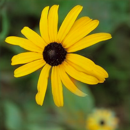 | 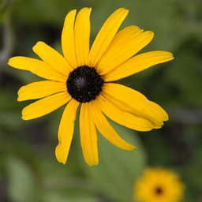 |
|  |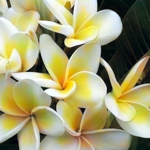 | 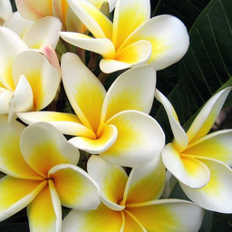 |
| 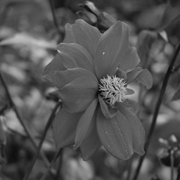 |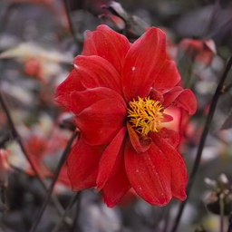 | 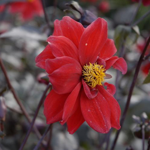 |
| 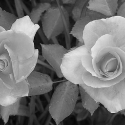 |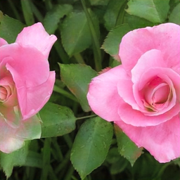 | 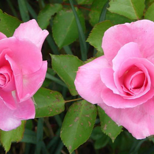 |

Experimental results on Pokemon data. Test images are crawled from the internet

| Input | Result | Ground Truth |
| --- | --- | --- |
| 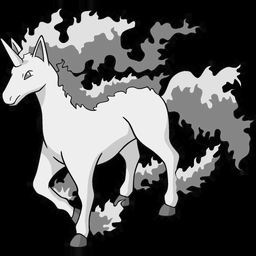 |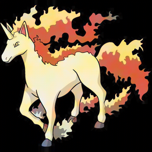 | 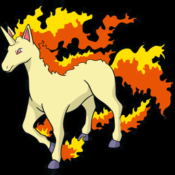 |
| 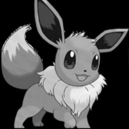 |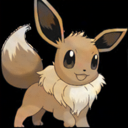 |  |
| 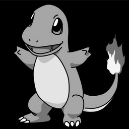 |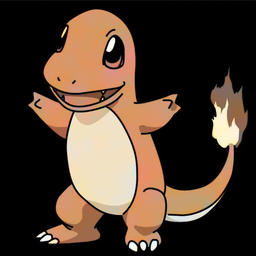 | 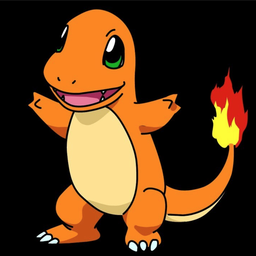 |

Experimental results on Superhero data. Train images and test images are crawled from the internet.

| Input | Result | Ground Truth |
| --- | --- | --- |
|  |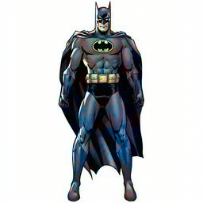 |  |
| 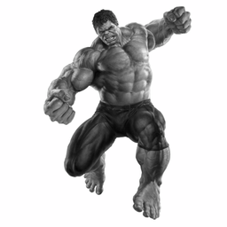 |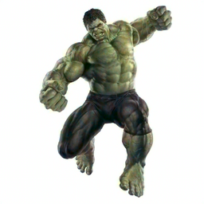 | 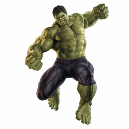 |
| 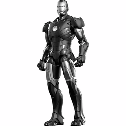 |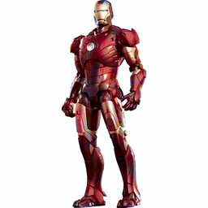 | 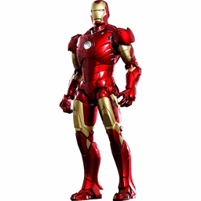 |

## Comments
If you have any questions or comments on my codes, please email to me. [son1113@snu.ac.kr](mailto:son1113@snu.ac.kr)

## References
[1]. https://github.com/awesome-davian/Text2Colors
* The most parts of discriminator.py are borrowed from [1]

 [2]. https://github.com/nilboy/colorization-tf
* The parts for quantizing ab values into 313 color bins are borrowed from [2]

[3]. https://github.com/NVlabs/MUNIT

[4]. https://github.com/RUSH-LAB/LSH_Memory
